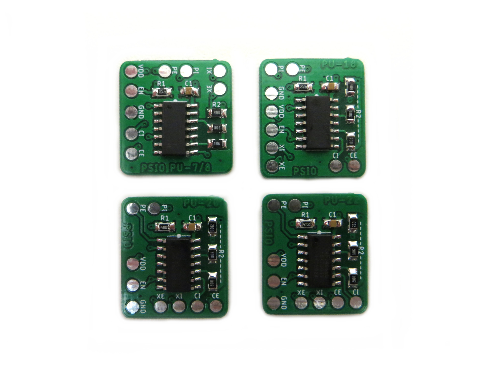

# Sony PlayStation PSIO Switchboards

My set of PSIO switchboard designed to make installs cleaner than the supplied switchboard.

## Why?

At a time when I was doing weekly PSIO installs I designed some new switchboards to make installs cleaner in all revisions. Somewhat redundant now SIO-XS exists. I am including them here as a curiosity.

## Version History

- PSIO Switchboard PU-8 v1 - 23/11/2020
- PSIO Switchboard PU-18 v1 - 23/11/2020
- PSIO Switchboard PU-20 v1 - 23/11/2020
- PSIO Switchboard PU-22 v1 - 23/11/2020

## Donate

Working on designs to release for free can be both time consuming and expensive. If you like what I do, a small donation will go a long way in helping me continue to serve the modding community as best as I can, with many more free and original guides, designs, and ideas to come.

